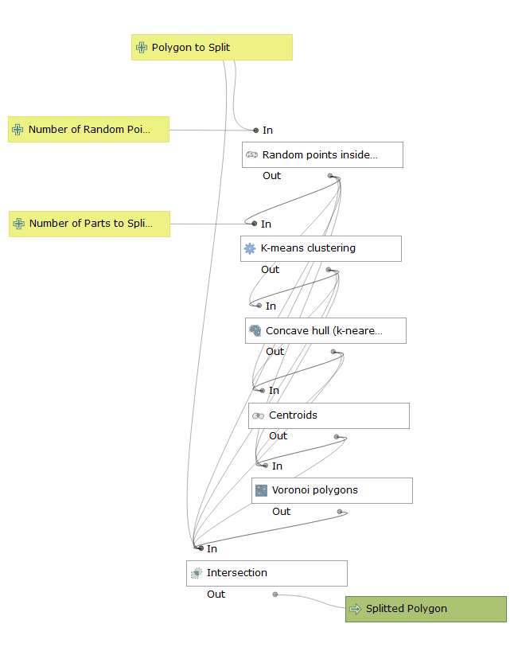
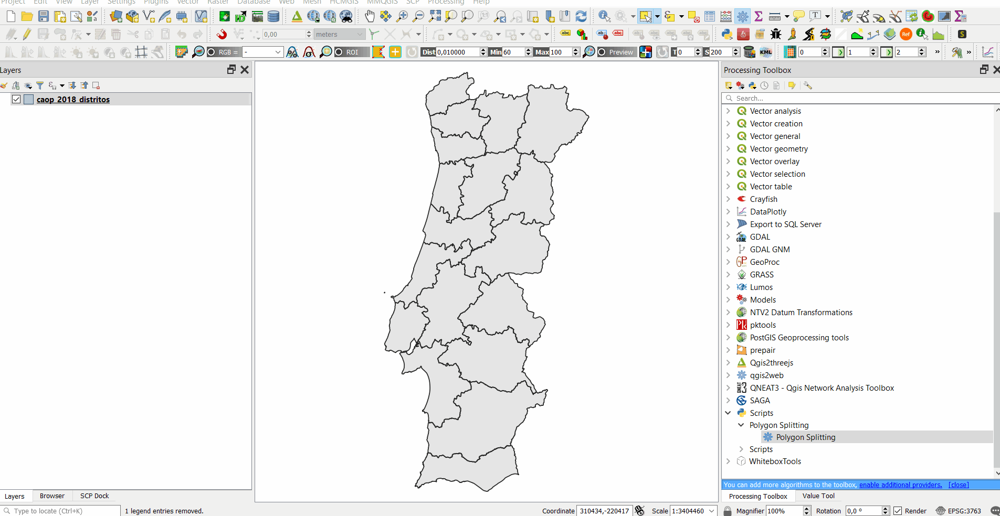

QGIS Polygon Splitting
--------------------------------------

QGIS 3 script to split a polygon into sub-polygons of more-or-less equal areas

Based on Paul Ramsey's post "PostGIS Polygon Splitting": http://blog.cleverelephant.ca/2018/06/polygon-splitting.html

To use it, just copy the QGISPolygonSplitting.py to your QGIS3 profile folder (https://docs.qgis.org/testing/en/docs/user_manual/introduction/qgis_configuration.html#working-with-user-profiles) -> processing -> scripts. On Windows it should be something like: C:\Users\YourUser\AppData\Roaming\QGIS\QGIS3\profiles\YourProfile\processing\scripts.

### How to use it

 * Split one polygon from a layer:

 * Split all polygons from a layer:

